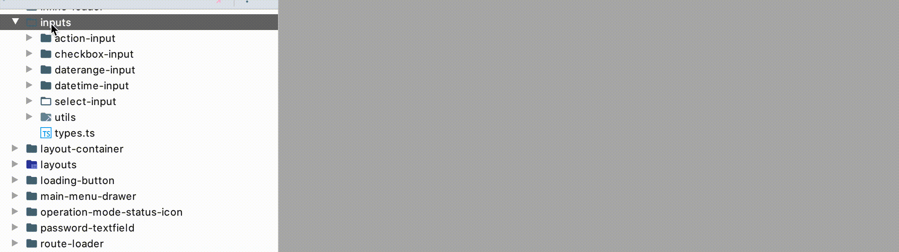

# react-component-creator
An Brainstorm Plugin to create a new react functional component with all additional files like
SCSS, Spec, Storybook

# Install
Search for `React Component Creator` in the plugins settings. Or download the plugin from the [release site](https://github.com/faebeee/react-component-creator-plugin/releases)

# Development
Follow the [Setup Instructions](./doc/DEVELOPMENT.md)

# Icons
Icons provided by https://www.iconfinder.com/justicon via https://www.iconfinder.com
